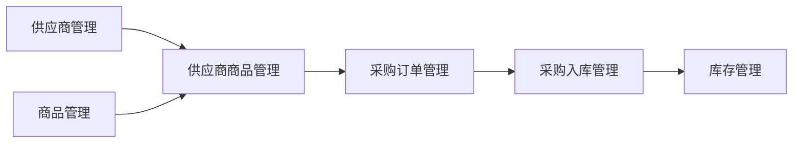

# 🛒 供应商商品管理模块开发计划

> **项目**: VLIASCRM 眼镜店管理系统  
> **模块**: 供应商商品关联管理  
> **版本**: v1.0  
> **创建时间**: {{ 当前时间 }}

---

## 📋 概述

### 🎯 **业务目标**
建立供应商与商品的关联关系管理模块，实现：
- 供应商商品目录管理
- 采购价格管理与比较
- 供应商采购条件设置
- 采购决策支持系统

### 🔗 **系统关联**


---

## 🗂️ **模块命名规范**

### 📂 **目录结构**
```
backend/
├── src/main/java/com/example/vliascrm/
│   ├── entity/PurSupplierGoods.java           # 实体类
│   ├── dto/PurSupplierGoodsDto.java           # 数据传输对象
│   ├── repository/PurSupplierGoodsRepository.java  # 数据访问层
│   ├── service/PurSupplierGoodsService.java   # 服务接口
│   ├── service/impl/PurSupplierGoodsServiceImpl.java  # 服务实现
│   └── controller/PurSupplierGoodsController.java     # 控制器

frontend/
├── src/
│   ├── api/supplierGoods.js                   # API接口
│   ├── views/purchase/SupplierGoodsList.vue   # 列表页面
│   ├── views/purchase/SupplierGoodsForm.vue   # 表单页面
│   └── components/GoodsSelector/              # 商品选择器组件
```

### 🏷️ **命名约定**
- **数据库表**: `pur_supplier_goods` (已存在)
- **Java类前缀**: `PurSupplierGoods`
- **API前缀**: `/api/purchase/supplier-goods`
- **前端路由**: `/purchase/supplier-goods`
- **Vue组件**: `SupplierGoods` 前缀

---

## 🔐 **权限系统设计**

### 📊 **权限编码结构**
遵循系统3级权限结构：`模块-子功能:操作`

#### **二级权限（功能模块）**
```yaml
权限名称: 供应商商品管理
权限代码: supplier-goods-management
所属模块: purchase (采购管理)
```

#### **三级权限（操作权限）**
| 权限名称 | 权限代码 | 操作类型 | 描述 |
|---------|---------|---------|-----|
| 查看供应商商品 | `supplier-goods-management:view` | 查看 | 查看供应商商品列表和详情 |
| 新增供应商商品 | `supplier-goods-management:create` | 创建 | 添加新的供应商商品关联 |
| 编辑供应商商品 | `supplier-goods-management:edit` | 编辑 | 修改供应商商品信息 |
| 删除供应商商品 | `supplier-goods-management:delete` | 删除 | 删除供应商商品关联 |
| 导出供应商商品 | `supplier-goods-management:export` | 导出 | 导出供应商商品数据 |
| 导入供应商商品 | `supplier-goods-management:import` | 导入 | 批量导入供应商商品 |
| 价格比较 | `supplier-goods-management:compare` | 特殊操作 | 比较不同供应商价格 |

### 🔧 **权限配置**
```javascript
// frontend/src/utils/permission.js
PURCHASE: {
  // 供应商商品管理
  SUPPLIER_GOODS: {
    VIEW: 'supplier-goods-management:view',
    CREATE: 'supplier-goods-management:create',
    EDIT: 'supplier-goods-management:edit',
    DELETE: 'supplier-goods-management:delete',
    EXPORT: 'supplier-goods-management:export',
    IMPORT: 'supplier-goods-management:import',
    COMPARE: 'supplier-goods-management:compare'
  }
}
```

---

## 🛣️ **路由配置**

### 🌐 **前端路由**
```javascript
// frontend/src/router/index.js
{
  path: 'purchase/supplier-goods',
  name: 'supplier-goods',
  component: () => import('@/views/purchase/SupplierGoodsList.vue'),
  meta: { 
    title: '供应商商品管理',
    requiresAuth: true,
    permission: 'supplier-goods-management:view'
  }
},
{
  path: 'purchase/supplier-goods/create',
  name: 'supplier-goods-create',
  component: () => import('@/views/purchase/SupplierGoodsForm.vue'),
  meta: { 
    title: '新增供应商商品',
    requiresAuth: true,
    permission: 'supplier-goods-management:create'
  }
},
{
  path: 'purchase/supplier-goods/edit/:id',
  name: 'supplier-goods-edit',
  component: () => import('@/views/purchase/SupplierGoodsForm.vue'),
  meta: { 
    title: '编辑供应商商品',
    requiresAuth: true,
    permission: 'supplier-goods-management:edit'
  }
},
{
  path: 'purchase/supplier-goods/compare',
  name: 'supplier-goods-compare',
  component: () => import('@/views/purchase/SupplierGoodsCompare.vue'),
  meta: { 
    title: '供应商价格比较',
    requiresAuth: true,
    permission: 'supplier-goods-management:compare'
  }
}
```

### 🔗 **后端路由**
```java
@RequestMapping("/api/purchase/supplier-goods")
public class PurSupplierGoodsController {
    // 基础CRUD
    @GetMapping                 // 分页查询
    @GetMapping("/{id}")        // 根据ID查询
    @PostMapping                // 新增
    @PutMapping("/{id}")        // 更新
    @DeleteMapping("/{id}")     // 删除
    
    // 业务功能
    @GetMapping("/supplier/{supplierId}")     // 查询供应商的所有商品
    @GetMapping("/goods/{goodsId}")           // 查询商品的所有供应商
    @GetMapping("/compare/{goodsId}")         // 价格比较
    @PostMapping("/batch")                    // 批量新增
    @PostMapping("/import")                   // 导入
    @GetMapping("/export")                    // 导出
}
```

---

## 🔌 **API接口设计**

### 📊 **数据传输对象**
```java
public class PurSupplierGoodsDto {
    private Long id;                          // 主键ID
    private Long supplierId;                  // 供应商ID
    private String supplierName;              // 供应商名称
    private Long goodsId;                     // 商品ID
    private String goodsName;                 // 商品名称
    private String goodsCode;                 // 商品编码
    private Long skuId;                       // SKU ID
    private String skuName;                   // SKU名称
    private String supplierGoodsCode;         // 供应商商品编码
    private String supplierGoodsName;         // 供应商商品名称
    private BigDecimal purchasePrice;         // 采购价
    private Integer minPurchaseQty;           // 最小采购量
    private Integer deliveryDay;              // 交货天数
    private Integer status;                   // 状态
    private String remark;                    // 备注
    private LocalDateTime createTime;         // 创建时间
    private LocalDateTime updateTime;         // 更新时间
}
```

### 🌐 **API接口列表**

#### **基础CRUD接口**
```yaml
# 分页查询供应商商品
GET /api/purchase/supplier-goods
Parameters:
  - supplierId: Long (可选) - 供应商ID
  - goodsId: Long (可选) - 商品ID
  - goodsName: String (可选) - 商品名称
  - status: Integer (可选) - 状态
  - page: int - 页码
  - size: int - 每页数量
Response: Page<PurSupplierGoodsDto>

# 根据ID查询
GET /api/purchase/supplier-goods/{id}
Response: PurSupplierGoodsDto

# 新增供应商商品
POST /api/purchase/supplier-goods
Body: PurSupplierGoodsDto
Response: PurSupplierGoodsDto

# 更新供应商商品
PUT /api/purchase/supplier-goods/{id}
Body: PurSupplierGoodsDto
Response: PurSupplierGoodsDto

# 删除供应商商品
DELETE /api/purchase/supplier-goods/{id}
Response: 删除成功消息
```

#### **业务功能接口**
```yaml
# 查询供应商的所有商品
GET /api/purchase/supplier-goods/supplier/{supplierId}
Response: List<PurSupplierGoodsDto>

# 查询商品的所有供应商
GET /api/purchase/supplier-goods/goods/{goodsId}
Response: List<PurSupplierGoodsDto>

# 价格比较
GET /api/purchase/supplier-goods/compare/{goodsId}
Response: List<SupplierPriceCompareDto>

# 批量新增
POST /api/purchase/supplier-goods/batch
Body: List<PurSupplierGoodsDto>
Response: 批量新增结果

# 导入数据
POST /api/purchase/supplier-goods/import
Body: MultipartFile (Excel文件)
Response: 导入结果统计

# 导出数据
GET /api/purchase/supplier-goods/export
Parameters: 查询条件
Response: Excel文件下载
```

### 📊 **价格比较DTO**
```java
public class SupplierPriceCompareDto {
    private Long goodsId;                     // 商品ID
    private String goodsName;                 // 商品名称
    private String goodsCode;                 // 商品编码
    private List<SupplierPriceInfo> suppliers; // 供应商价格信息
    
    public static class SupplierPriceInfo {
        private Long supplierId;              // 供应商ID
        private String supplierName;          // 供应商名称
        private BigDecimal purchasePrice;     // 采购价
        private Integer minPurchaseQty;       // 最小采购量
        private Integer deliveryDay;          // 交货天数
        private Boolean isRecommended;        // 是否推荐
    }
}
```

---

## 🎨 **前端页面设计**

### 📋 **页面结构**

#### **1. 供应商商品列表页**
```vue
<!-- SupplierGoodsList.vue -->
<template>
  <!-- 搜索筛选区域 -->
  <SearchForm>
    - 供应商选择器
    - 商品名称输入
    - 状态筛选
    - 价格范围
  </SearchForm>
  
  <!-- 操作按钮区域 -->
  <ActionButtons>
    - 新增供应商商品
    - 批量导入
    - 导出数据
    - 价格比较
  </ActionButtons>
  
  <!-- 数据表格 -->
  <DataTable>
    - 供应商信息
    - 商品信息
    - 采购价格
    - 采购条件
    - 操作按钮
  </DataTable>
  
  <!-- 分页组件 -->
  <Pagination />
</template>
```

#### **2. 供应商商品表单页**
```vue
<!-- SupplierGoodsForm.vue -->
<template>
  <Form>
    <!-- 基础信息 -->
    <FormSection title="基础信息">
      - 供应商选择器
      - 商品选择器 (支持SKU级别)
      - 供应商商品编码
      - 供应商商品名称
    </FormSection>
    
    <!-- 采购信息 -->
    <FormSection title="采购信息">
      - 采购价格
      - 最小采购量
      - 交货天数
      - 状态
    </FormSection>
    
    <!-- 备注信息 -->
    <FormSection title="备注">
      - 备注文本框
    </FormSection>
    
    <!-- 操作按钮 -->
    <ActionButtons>
      - 保存
      - 保存并继续
      - 取消
    </ActionButtons>
  </Form>
</template>
```

#### **3. 价格比较页**
```vue
<!-- SupplierGoodsCompare.vue -->
<template>
  <!-- 商品选择 -->
  <GoodsSelector />
  
  <!-- 比较表格 -->
  <CompareTable>
    - 供应商列表
    - 价格对比
    - 采购条件对比
    - 推荐标识
  </CompareTable>
  
  <!-- 操作按钮 -->
  <ActionButtons>
    - 选择供应商创建采购订单
    - 导出比较结果
  </ActionButtons>
</template>
```

### 🧩 **组件复用**

#### **商品选择器组件**
```vue
<!-- components/GoodsSelector/GoodsSelector.vue -->
<template>
  <el-select 
    v-model="selectedGoods"
    filterable
    remote
    :remote-method="searchGoods"
    :loading="loading"
  >
    <el-option
      v-for="goods in goodsList"
      :key="goods.id"
      :label="`${goods.goodsName} (${goods.goodsCode})`"
      :value="goods.id"
    />
  </el-select>
</template>
```

#### **供应商选择器组件**
```vue
<!-- components/SupplierSelector/SupplierSelector.vue -->
<template>
  <el-select 
    v-model="selectedSupplier"
    filterable
    :disabled="disabled"
  >
    <el-option
      v-for="supplier in supplierList"
      :key="supplier.id"
      :label="supplier.supplierName"
      :value="supplier.id"
    />
  </el-select>
</template>
```

---

## 🏗️ **后端开发计划**

### 📊 **开发优先级**

#### **Phase 1: 基础功能 (1周)**
- [ ] 创建实体类 `PurSupplierGoods.java`
- [ ] 创建DTO `PurSupplierGoodsDto.java`
- [ ] 创建Repository `PurSupplierGoodsRepository.java`
- [ ] 创建Service接口和实现
- [ ] 实现基础CRUD Controller

#### **Phase 2: 业务功能 (1周)**
- [ ] 供应商商品查询接口
- [ ] 商品供应商查询接口
- [ ] 价格比较功能
- [ ] 批量操作功能

#### **Phase 3: 导入导出 (3天)**
- [ ] Excel导入功能
- [ ] Excel导出功能
- [ ] 数据验证和错误处理

### 🔧 **技术实现要点**

#### **数据查询优化**
```java
// 使用联表查询减少N+1问题
@Query("SELECT new com.example.vliascrm.dto.PurSupplierGoodsDto(" +
       "sg.id, s.supplierName, g.goodsName, g.goodsCode, " +
       "sg.purchasePrice, sg.minPurchaseQty, sg.deliveryDay) " +
       "FROM PurSupplierGoods sg " +
       "LEFT JOIN PurSupplier s ON sg.supplierId = s.id " +
       "LEFT JOIN ProdGoods g ON sg.goodsId = g.id")
Page<PurSupplierGoodsDto> findPageWithDetails(Pageable pageable);
```

#### **价格比较算法**
```java
public List<SupplierPriceCompareDto> comparePrice(Long goodsId) {
    // 1. 查询商品的所有供应商
    List<PurSupplierGoods> supplierGoods = findByGoodsId(goodsId);
    
    // 2. 按价格排序
    supplierGoods.sort(Comparator.comparing(PurSupplierGoods::getPurchasePrice));
    
    // 3. 计算推荐供应商(综合价格、交货期、最小采购量)
    return calculateRecommendation(supplierGoods);
}
```

---

## 🎨 **前端开发计划**

### 📊 **开发优先级**

#### **Phase 1: 基础页面 (1周)**
- [ ] 创建API接口文件 `supplierGoods.js`
- [ ] 开发列表页面 `SupplierGoodsList.vue`
- [ ] 开发表单页面 `SupplierGoodsForm.vue`
- [ ] 配置路由

#### **Phase 2: 组件开发 (3天)**
- [ ] 商品选择器组件
- [ ] 供应商选择器组件
- [ ] 价格比较组件

#### **Phase 3: 高级功能 (4天)**
- [ ] 价格比较页面
- [ ] 批量导入功能
- [ ] 导出功能
- [ ] 权限控制集成

### 🎯 **用户体验优化**

#### **交互设计**
- **智能搜索**: 商品/供应商模糊搜索，支持拼音
- **快速操作**: 双击编辑，右键菜单
- **数据验证**: 实时表单验证，错误提示
- **加载状态**: Loading动画，分页加载

#### **视觉设计**
- **价格标识**: 最低价高亮显示
- **状态图标**: 不同状态用不同颜色
- **操作按钮**: 统一的操作按钮样式
- **响应式**: 支持移动端查看

---

## 📊 **数据库优化**

### 🔍 **索引设计**
```sql
-- 供应商查询优化
CREATE INDEX idx_supplier_goods_supplier_id ON pur_supplier_goods(supplier_id);

-- 商品查询优化  
CREATE INDEX idx_supplier_goods_goods_id ON pur_supplier_goods(goods_id);

-- 价格查询优化
CREATE INDEX idx_supplier_goods_price ON pur_supplier_goods(goods_id, purchase_price);

-- 复合查询优化
CREATE INDEX idx_supplier_goods_status ON pur_supplier_goods(supplier_id, goods_id, status);
```

### 📈 **性能优化**
- **分页查询**: 使用LIMIT优化大数据量查询
- **缓存策略**: Redis缓存热门商品供应商数据
- **查询优化**: 避免N+1查询，使用JOIN
- **数据归档**: 定期归档历史价格数据

---

## 🧪 **测试计划**

### 🔬 **单元测试**
```java
@SpringBootTest
class PurSupplierGoodsServiceTest {
    
    @Test
    void testCreateSupplierGoods() {
        // 测试创建供应商商品关联
    }
    
    @Test
    void testPriceCompare() {
        // 测试价格比较功能
    }
    
    @Test
    void testBatchImport() {
        // 测试批量导入功能
    }
}
```

### 🌐 **集成测试**
- API接口测试
- 前后端联调测试
- 权限验证测试
- 性能压力测试

### 👥 **用户验收测试**
- 供应商商品录入流程
- 价格比较功能验证
- 采购订单创建联动
- 导入导出功能验证

---

## 📅 **开发时间计划**

### 📊 **总体时间安排**
| 阶段 | 任务 | 预估时间 | 负责人 |
|-----|-----|---------|--------|
| Phase 1 | 后端基础功能开发 | 5天 | 后端开发 |
| Phase 2 | 前端基础页面开发 | 5天 | 前端开发 |
| Phase 3 | 业务功能开发 | 3天 | 全栈 |
| Phase 4 | 组件和高级功能 | 4天 | 前端开发 |
| Phase 5 | 导入导出功能 | 3天 | 后端开发 |
| Phase 6 | 测试和优化 | 3天 | 全栈 |
| **总计** | | **23天** | |

### 🎯 **里程碑节点**
- **Week 1**: 完成基础CRUD功能
- **Week 2**: 完成业务功能和前端页面
- **Week 3**: 完成测试和上线部署

---

## 🔍 **风险评估**

### ⚠️ **技术风险**
| 风险项 | 影响程度 | 应对措施 |
|--------|---------|----------|
| 数据量大导致查询慢 | 中 | 建立合适索引，分页查询 |
| 价格比较算法复杂 | 低 | 简化算法，分步实现 |
| 前端组件复用度低 | 中 | 统一组件设计规范 |

### 📋 **业务风险**
| 风险项 | 影响程度 | 应对措施 |
|--------|---------|----------|
| 供应商商品信息变更频繁 | 高 | 建立价格历史记录功能 |
| 批量导入数据质量问题 | 中 | 严格数据验证和错误提示 |
| 权限控制不当 | 高 | 完整的权限测试覆盖 |

---

## 📋 **验收标准**

### ✅ **功能验收**
- [ ] 供应商商品CRUD操作正常
- [ ] 价格比较功能准确
- [ ] 批量导入导出功能正常
- [ ] 权限控制有效
- [ ] 数据完整性保证

### 🚀 **性能验收**
- [ ] 列表查询响应时间 < 1s
- [ ] 价格比较响应时间 < 2s  
- [ ] 支持1000+供应商商品数据
- [ ] 导入1000条数据 < 30s

### 🎨 **用户体验验收**
- [ ] 界面操作流畅
- [ ] 错误提示友好
- [ ] 移动端兼容性良好
- [ ] 操作逻辑符合用户习惯

---

## 📚 **相关文档**

### 📖 **技术文档**
- [数据库设计文档](docs/database/VLIAS数据库设计方案.md)
- [权限系统设计](docs/database/权限3级结构设计文档.md)
- [API接口规范](docs/api/接口设计规范.md)

### 🔧 **开发规范**
- [Java编码规范](docs/standards/Java编码规范.md)
- [Vue开发规范](docs/standards/Vue开发规范.md)
- [数据库设计规范](docs/standards/数据库设计规范.md)

---

## 📞 **联系方式**

| 角色 | 姓名 | 联系方式 |
|-----|-----|---------|
| 项目经理 | - | - |
| 后端开发 | - | - |
| 前端开发 | - | - |
| 测试人员 | - | - |

---

*本计划将根据实际开发进度进行调整和更新* 📝 